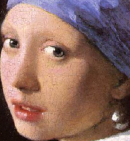

# Simple Image Editor Haskell

Lei Mao

University of Chicago

## Introduction

This is a simple editor for [PPM](https://en.wikipedia.org/wiki/Netpbm_format) formatted images written in Haskell. It supports negate R/G/B, gray scale, edge detection, and sharpen. The processing of image might be somewhat slower compared to similar editors written in other language (due to implementation in Haskell).

Sample PPM formatted file:

```
P3
4 4
255
0  0  0   100 0  0       0  0  0    255   0 255
0  0  0    0 255 175     0  0  0     0    0  0
0  0  0    0  0  0       0 15 175    0    0  0
255 0 255  0  0  0       0  0  0    255  255 255
```
## Dependencies

* GHC 8.2.2


## Usage

### Installation

To install the program, run the following command in the shell:

```bash
$ make
```

### Start Program

To start the program, run the following command in the shell and follow the instructions in the program:

```bash
$ ./Main
```
Multiple sequential actions is also allowed.

## Demo

```
********************************************
******* Welcome to the Image Editor ********
********************************************

============ Choose Your Action ============
(1) Read PPM Image 
(2) Exit 
1
Please Input File Directory: 
sample/blocks.ppm
============ Choose Your Action ============
Choose Image Operations: 
(1) Negate R Channel
(2) Negate G Channel
(3) Negate B Channel
(4) Gray Image
(5) Edge Detection
(6) Sharpen Image
(7) Save and Exit
(8) Exit without Save
4
============ Choose Your Action ============
Choose Image Operations: 
(1) Negate R Channel
(2) Negate G Channel
(3) Negate B Channel
(4) Gray Image
(5) Edge Detection
(6) Sharpen Image
(7) Save and Exit
(8) Exit without Save
7
Input save directory: 
sample/blocks_gray.ppm
Image Saved Successfully
============ Choose Your Action ============
(1) Read PPM Image 
(2) Exit 
```

GitHub markdown does not support displaying ppm images. The demo ppm images were converted to png and displayed on this page.

Raw                     |  Edge
 | 